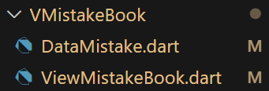

# project_soe

- ECNU-SOE 移动app客户端代码仓

# 目录结构

- 所有源码源码放在 /lib 目录之下, /android 目录下存放的是配置文件.
- 以开头的大写字母表示该**目录之下所存放的**主要内容
  - V : View 界面
  - L : Logic 逻辑内容
  - G : Global 全局变量/常量
  - C : Components 组件
  - main.dart 程序主入口
- 文件名前缀表示该文件的内容
  - View : 定义界面
  - Page : 有时候一些比较复杂的界面需要子页面
  - Component : 组件, 需要常用或者复用的 小元件可以被构成为组件, 方便多次使用.
  - Logic : 辅助函数 / 单例, 管理类
  - Data : 数据结构体 / 数据解析
  - Msg : 服务器消息收发 & 解析
- 值得注意的一些文件
  - LogicNavigation.dart 定义 navigator的数据和子页面逻辑
  - LogicAuthorition.dart 定义 登录信息的**单例**用于存储, 管理和获取登陆相关的信息(如usertoken)
    - 具体调用方法为 AuthoritionState.instance.getToken()

# 命名规范

- 目录名, 文件名, 类名, 均使用**大写开头驼峰式**, 前缀参见上述目录结构.
- 函数名, 变量名, 均为**小写开头驼峰式**.
- 私有变量, 私有函数, 私有类, 使用下划线开头 _ClassName

# 例: 添加新界面的流程

- 以错题本界面, ViewMistakeBook为例
- 你可以删除这个目录下的全部内容, 或者在git里checkout至6.15的提交并开启新的分支, 在新分支里根据这个指南来练习.

1. 创建文件目录VMistakeBook, 该目录对应该错题本界面需要使用的所有文件, 包括数据, 信息收发, 界面等. 并在VMistakeBook目录下, 新建文件 ViewMistakeBook.dart (界面), DataMistake.dart (数据类),

2. 实现数据类以及数据解析
    - 查询soe接口文档 <https://documenter.getpostman.com/view/11123680/2s93K1nyRT#378a68de-7db8-44dd-882a-561bb6ca675d>, 根据接口 <http://xxx.xxx.xxx.xxx:xxx/corpus-server/api/mistake/v1/getDetail?oneWeekKey=0> 返回的数据格式.
    - 在文件DataMistakeBook.dart中创建并实现DataMistakeBook数据类

    ```json
    {
        "code": 0,
        "data": {
            "eachMistakeTypeNumber": [ //每个题型的错题数据，是一个数组形式
                {
                    "mistakeNum": 3,//该类型题目错题数
                    "mistakeTypeName": "语音评测",//题目类型
                    "mistakeTypeCode": 0 //题目类型code
                }
            ],
            "mistakeTotalNumber": 3,//总错题数
            "stubbornMistakeNumber": 1 //顽固错题数，即用户重复错误次数>1
        },
        "msg": null
    }
    ```

    - 根据json数据, 接口<http://xxx.xxx.xxx.xxx:xxx/corpus-server/api/mistake/v1/getDetail?oneWeekKey=0> 返回的数据是```int mistakeTotalNumber,int stubbornMistakeNumber, List eachMistakeTypeNumber,``` , 其中eachMistakeTypeNumber的数据结构为```int mistakeNum, String mistakeTypeName, int mistakeTypeCode```
    - 所以可以定义出DataMistakeListItem和DataMistakeBook

    ```dart
    // 错题本页面的数据
    class DataMistakeBook {
        final int mistakeTotalNumber;
        final int stubbornMistakeNumber;
        final List<DataMistakeBookListItem> eachMistakeTypeNumber;
        // 构造函数
        DataMistakeBook({required this.mistakeItemList});
    }
    // 错题本页面一项选单的数据 ListItem
    class DataMistakeBookListItem {
        final int mistakeTypeCode;
        final String mistakeTypeName;
        // 构造函数
        DataMistakeBookListItem({
            required this.mistakeTypeCode,
            required this.mistakeTypeName,
        });
    }
    ```

    - 然后为为DataMistakeBookListItem 添加来自Json的数据解析函数

    ```dart
    // in class DataMistakeBookListItem {
    factory DataMistakeBookListItem.fromJson(Map<String, dynamic> json) {
        return DataMistakeBookListItem(
            mistakeTypeCode: json['mistakeTypeCode'],
            mistakeTypeName: json['mistakeTypeName'],
        );
    }
    ```

3. 实现从服务器发送请求, 获取数据并解析的函数
    - 同样在文件DataMistakeBook.dart中, 如果有很多的服务器协议需要解析和收发, 可以考虑新建一个文件MsgMistakeBook.dart, 但目前我们只实现一个接口, 所以在DataMistakeBook.dart中实现足够
    - DataMistakeBook.dart中新增函数, 注意不需要添加到类里

    ```dart
    // in DataMistakeBook.dart
    // Future<DataMistakeBook> FunctionName() async 定义了一个异步函数, 返回值可以被理解为一个 "等待其返回为DataMistakeBook类型的句柄" 
    // getGetDataMistakeBook() 因为这个函数使用http.get请求, 所以函数名前缀为get, 如果是post请求可以命名为 postGetDataMistakeBook()
    Future<DataMistakeBook> getGetDataMistakeBook() async {
        // AuthoritionState.instance 获取AuthritionState的单例, 然后获取用户 token
        final token = AuthritionState.instance.getToken();
        // 根据接口地址解析Uri
        final uri = Uri.parse(
            "http://xxx.xxx.xxx.xxx:xxx/corpus-server/api/mistake/v1/getDetail?oneWeekKey=0");
        // 获取http.Client()并发送get请求
        // http.Clinet().get() 也是一个async异步函数, 所以需要await它等待其返回
        final response = await http.Client().get(
            // 已经解析好的uri
            uri,
            // headers里指定token字段为刚刚获取的token
            headers: {
            'token': token,
            },
        );
        // 将返回的response解码, 这两个行代码对每一个http请求都适用
        final u8decoded = utf8.decode(response.bodyBytes);
        final decoded = jsonDecode(u8decoded);
        // 先判断返回的code是否为0
        final code = decoded['code'];
        if (code != 0) {
            throw ("wrong return code");
        }
        // 在返回的json中获取eachMistakeTypeNumber
        final mistakeItemList = decoded['data']['eachMistakeTypeNumber'];
        List<DataMistakeItem> listMistake = List.empty(growable: true);
        // 遍历list, 用已经编写好的 fromJson函数添加新的item
        for (final mistake in mistakeItemList) {
            listMistake.add(DataMistakeItem.fromJson(mistake));
        }
        // 返回DataMistakeBook()
        return DataMistakeBook(mistakeItemList: listMistake);
    }
    ```

4. 实现ViewMistakeBook界面
    - 于目录VMistakeBook中, 创建文件ViewMistakeBook.dart
    - 实现ViewMistakeBook

    ```dart
    // flutter基础: ViewMistakeBook 继承自 StatelessWidget
    class ViewMistakeBook extends StatelessWidget {
        // 静态常量字符串 routeName 给这个route命名, 这个名字是该View独有的, 要在全局的navigator里使用
        static const String routeName = 'mistake';
        // 实现其buildfunc
        @override
        Widget build(BuildContext context) {
            return Scaffold(
                // 这个body可以自行实现, 可以是 Stateful或者Stateless
                body: _ViewMistakeBookBody(),
                backgroundColor: gColorE3EDF7RGBA,
                // 此二处使用已有的Component
                bottomNavigationBar: ComponentBottomNavigator(
                    curRouteName: routeName,
                ),
                appBar: ComponentAppBar(
                    hasBackButton: true,
                    title: ComponentTitle(
                    label: '错题本',
                    style: gTitleStyle,
                    ),
                ),
            );
        }
    }
    ```

    - 实现(对于文件ViewMistakeBook.dart的)私有类_ViewMistakeBookBody

    ```dart
    class _ViewMistakeBookBody extends StatelessWidget {
        @override
        // _ViewMistakeBookBody的返回值依赖一个 Future<DataMistakeBook> 类型返回值的函数getGetDataMistakeBook(), 所以使用泛型 FutureBuilder<DataMistakeBook>表示
        Widget build(BuildContext buildContext) => FutureBuilder<DataMistakeBook>(
                future: getGetDataMistakeBook(),
                builder: (context, snapshot) {
                // snapshot代表的是getGetDataMistakeBook()的返回值
                if (snapshot.hasData) {
                    // 私有函数, 可以自行实现
                    return _buildBodyImpl(context, snapshot.data!);
                } else {
                    return CircularProgressIndicator();
                }
            },
        );
    }
    ```

5. 其他类中的对应操作

- 修改LogicNavigation.dart
    1. sNavigationRoutes加入新的View类的名字和对应的构造函数

    ```dart
    ViewMistakeBook.routeName: (context) => ViewMistakeBook(),
    ```

    2. 在sRouteMap中把ViewMistakeBook的route加入到对应的子目录之下, 错题本属于课堂界面(ViewClass)的下的界面, 所以

    ```dart
    ViewClass.routeName: [
        ViewPractice.routeName,
        ViewClass.routeName,
        ViewClassDetail.routeName,
        ViewMyClass.routeName,
        ViewMistakeBook.routeName, // + 
    ],
    ```

    3. 从其他界面打开错题本界面时使用函数

    ```dart
    navigator.of(context).pushNamed(ViewMistakeBook.routeName);
    ```

# Tips

- 需要使用某种组件的时候可以先看 CComponents\ 目录下有没有已经实现的类似组件, 比如按钮, 标题, 语音输入框, 编辑栏等已经有的组件, 直接使用 CComponents\ 中对应的组件即可.
- 可以在vscode中启动, 在 WidgetInspector 中观察某个页面的目录结构和对应的组件名字.
- Flutter有完整的文档和活跃的社区, 遇到的所有问题都可以查询 pub.dev 上对应的文档得到答案
